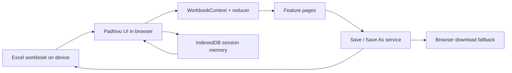

# Padhivu

Padhivu is a local-first workbook app for personal tracking. It uses a standard Excel workbook as the source of truth, so your data stays on your device instead of living in a remote database.

## What Is Implemented

- Workbook import from the landing page.
- Remembered previous workbook session, with an explicit continue/forget flow.
- Save, Save As, and browser download fallback for workbook export.
- Read-only dashboard with workbook-aware summaries.
- Tasks view with create, edit, delete, filter, and completion toggle.
- Expenses view with list, create, delete, and summary totals.
- Global search inside the app shell.
- Route-based navigation for the current workbook areas.

## Architecture



## Local-First And Privacy

- No backend API is used.
- No cloud account is required.
- The workbook file is the source of truth.
- Session memory only stores a previous workbook handle reference plus file metadata.
- Workbook content is not uploaded to a server by the app.
- When native file saving is unavailable, the app falls back to downloading a new workbook file.

## Supported Workbook Sheets

Padhivu currently reads and writes these worksheet names:

- `DailyLogs`
- `Expenses`
- `Tasks`
- `Memories`
- `Collections`
- `CustomModules`
- `ModuleFields`
- `ModuleEntries`
- `Settings`
- `Metadata`

Unknown worksheets are preserved during round trips so workbook users do not lose unrelated sheets.

## Setup

### Install dependencies

```bash
npm install
```

### Start the dev server

```bash
npm run dev
```

### Build for production

```bash
npm run build
```

### Preview the production build

```bash
npm run preview
```

## Manual Test Checklist

- Import a workbook from the landing page and confirm the app opens into the dashboard.
- Create a task and confirm it appears in the Tasks list.
- Create an expense and confirm it appears in the Expenses list.
- Use Save to write changes back to the current workbook when file access is available.
- Use Save As to export a new workbook copy.
- Disable browser file access or use a browser path that blocks it, then confirm the download fallback still produces a workbook file.

## Roadmap

These areas are visible in navigation but not yet fully implemented:

- Daily Logs
- Memories
- Collections
- Custom Modules
- Insights
- Settings

Each roadmap area will stay workbook-backed and local-first when it is added.